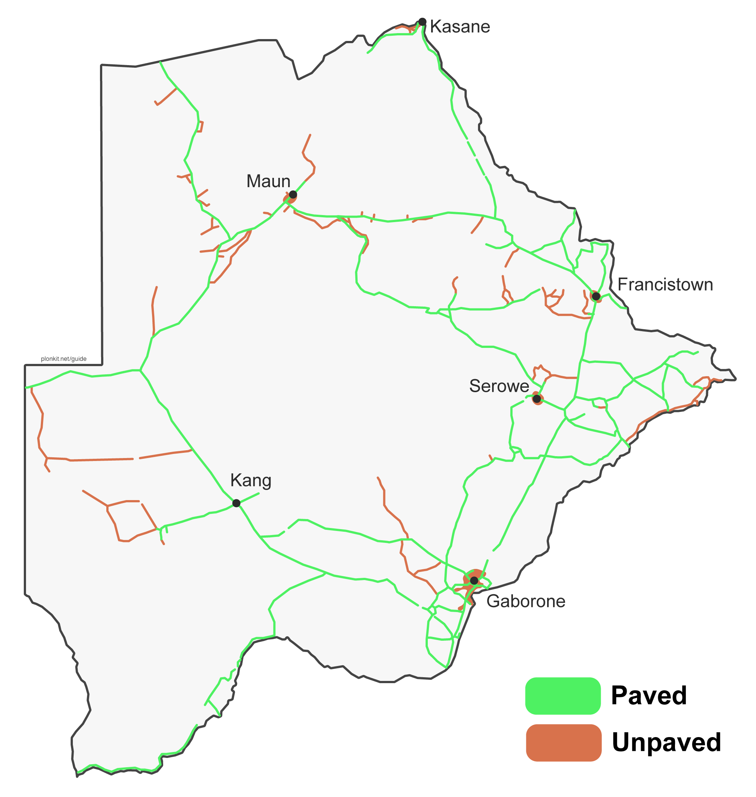

# 图寻语雀知识库审查与本轮扩充

核验日期：2026-09-25。研究入口：[图寻文档](https://www.yuque.com/chaofun/tuxun)。公开目录当日列出 259 篇文档；本轮阅读了[版权声明](https://www.yuque.com/chaofun/tuxun/copyright)、[覆盖与相机代数](https://www.yuque.com/chaofun/tuxun/coverage_and_generations)、[水箱](https://www.yuque.com/chaofun/tuxun/water_tank)、[婆罗米系文字](https://www.yuque.com/chaofun/tuxun/brahmic)、[拉丁字母](https://www.yuque.com/chaofun/tuxun/latin)，以及下表的国家指南。所有卡片说明均重新表述，未逐段复制教程。

| 研究主题 | 所用文档 | 落地内容 |
|---|---|---|
| 非洲路侧设施与车辆 | [博茨瓦纳](https://www.yuque.com/chaofun/tuxun/botswana)、[南非](https://www.yuque.com/chaofun/tuxun/south-africa)、[加纳](https://www.yuque.com/chaofun/tuxun/ghana)、[尼日利亚](https://www.yuque.com/chaofun/tuxun/nigeria) | 黄边线、三重中心线、条纹杆、电杆、出租车涂装；博茨瓦纳黄色后牌复用既有线索 |
| 美洲道路与景观 | [墨西哥](https://www.yuque.com/chaofun/tuxun/mexico)、[巴西](https://www.yuque.com/chaofun/tuxun/brazil) | ALTO、短圆桩、八棱电杆、黑牌背、蓝水箱、干灌丛和巴拉那松；巴西东北部与南部加入条件地区规则 |
| 亚洲文字与设施 | [菲律宾](https://www.yuque.com/chaofun/tuxun/philippines)、[泰国](https://www.yuque.com/chaofun/tuxun/thailand)、[印尼](https://www.yuque.com/chaofun/tuxun/indonesia)、[韩国](https://www.yuque.com/chaofun/tuxun/south-korea)、[巴以地区](https://www.yuque.com/chaofun/tuxun/israel-west-bank) | 三轮车、方桩和电杆、常见词、韩文、希伯来文与阿拉伯文；对相似文字保持跨国目标 |
| 欧洲标牌、文字和店招 | [英国](https://www.yuque.com/chaofun/tuxun/united-kingdom)、[土耳其](https://www.yuque.com/chaofun/tuxun/turkey)、[法国](https://www.yuque.com/chaofun/tuxun/france)、[芬兰](https://www.yuque.com/chaofun/tuxun/finland) | 黄色菱形、贝利沙灯、DUR、尖顶路桩、黄色警示边框、芬兰店招与街名 |

规则采用小到中等的启发式 log 权重。同一形态的多张图仍只是一条证据；路面、文字、零售品牌等相关线索放进共享证据组。教程中的“常见”“独特”并不是采样频率或全球独占性的证明，因此本轮没有据此创建硬排除规则。相机代际和特定路段线索更新快，本轮仅作阅读背景，没有把旧街景车图直接入库。

## 使用了语雀中的图片

下图是[博茨瓦纳指南](https://www.yuque.com/chaofun/tuxun/botswana)里的**道路覆盖示意图**，由 Plonk It 绘制、图寻汉化组转载，图寻文档保留的 `TuxunDoc` 与 `plonkit.net/guide` 标识未移除。它是人工绘制的覆盖示意，不含抽离的 Google Street View 画面。依[图寻版权声明](https://www.yuque.com/chaofun/tuxun/copyright)对 Plonk It Guide 系列的授权，以 [CC BY-NC-SA 4.0](https://creativecommons.org/licenses/by-nc-sa/4.0/) 单独再分发；本项目的代码许可证不适用于此图。原图在博茨瓦纳条纹标牌杆的说明中作为资料背景展示，不作为当前道路覆盖清单或可选视觉线索，因为图中道路覆盖可能已变化。

知识库中的大量实景图是 Google Street View 截图，图寻或译者的许可不能替代底层画面权利。因此本轮**没有**把这些截图抽出放进公开图库。实际新增 13 张 Wikimedia Commons 独立授权实拍，支持 14 条带图线索；其中同一张爱尔兰照片展示了两种不同视觉观察，相关规则归入同一证据组。逐张作者、许可与原图见 [ASSETS.md](ASSETS.md)。例如语雀[英国指南](https://www.yuque.com/chaofun/tuxun/united-kingdom)讲贝利沙灯，对应图卡采用 Basher Eyre 的 CC BY-SA 实拍；语雀[巴西指南](https://www.yuque.com/chaofun/tuxun/brazil)讲卡廷加干旱景观，对应图卡采用 A. Duarte 的 CC BY-SA 道路照片。这样使用了知识库的资料和一张原创示意图，同时保持图库照片的独立再分发依据。

## 本轮边界

- 语雀目录含翻译、用户投稿与转载，版权声明明确“各篇授权不一”。本轮没有把其公开可读误认为所有图片可自由转载。
- 塞浦路斯指南写明官方车载覆盖仅在岛南部，因此土耳其语/DUR 不给塞浦路斯候选加分；希腊文仍支持希腊与塞浦路斯。
- 新增规则是有出处的启发式匹配，不是实际 GeoGuessr 题库频率。照片拍摄地证明一种特征存在，不证明别国没有。
- 这批资料显著扩充国家线索，但距离 113 个候选都有深入资料仍有差距；地区规则目前只补充巴西的两个粗大区观察。
